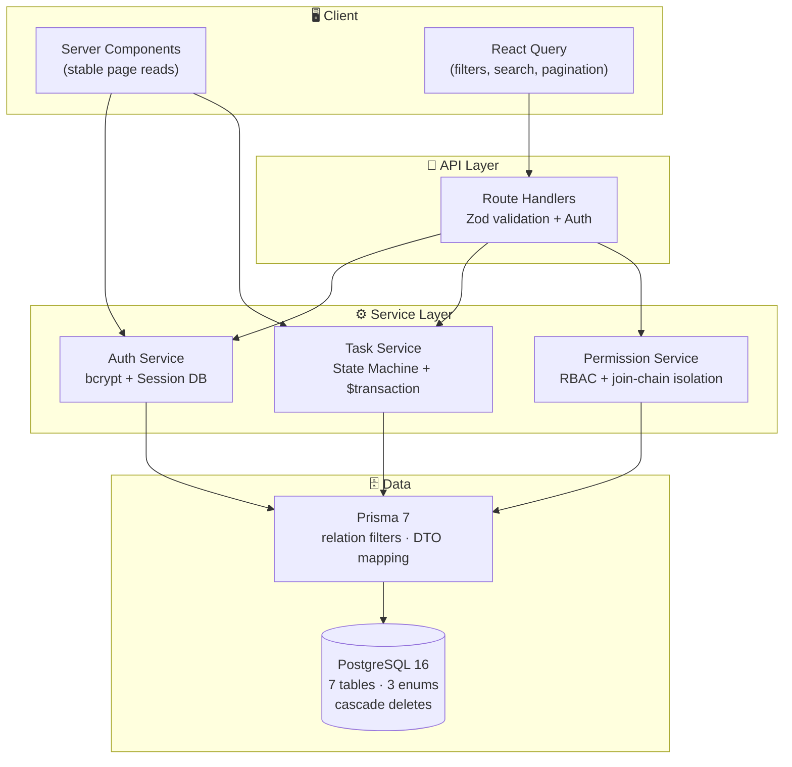

<p align="center">
  <picture>
    <source media="(prefers-color-scheme: dark)" srcset="public/screenshots/dashboard-dark.png">
    
  </picture>
</p>

<h1 align="center">Remote Task Board</h1>

<p align="center">
  <b>English</b> &nbsp;|&nbsp; <a href="./README.zh-CN.md">简体中文</a>
</p>

<p align="center">
  A full-stack task management platform for remote teams — built as a demonstration of modern TypeScript full-stack engineering.
</p>

<p align="center">
  <a href="https://github.com/GarrisonPJ/remote-task-board/actions/workflows/ci.yml"></a>
  <a href="#testing-strategy"></a>
  <a href="#tech-stack"></a>
  <a href="LICENSE"></a>
</p>

---

<p align="center">
  <a href="https://remote-task-board.netlify.app"><strong>🔗 Live Demo</strong></a>
  &nbsp;·&nbsp;
  <a href="#screenshots"><strong>📸 Screenshots</strong></a>
  &nbsp;·&nbsp;
  <a href="#architecture"><strong>🏗️ Architecture</strong></a>
  &nbsp;·&nbsp;
  <a href="#quick-start"><strong>⚡ Quick Start</strong></a>
  &nbsp;·&nbsp;
  <a href="#tech-stack"><strong>🧱 Tech Stack</strong></a>
  &nbsp;·&nbsp;
  <a href="#testing-strategy"><strong>🧪 Testing</strong></a>
</p>

<p align="center">
  <sub>Demo accounts: <code>alice@test.com</code> / <code>bob@test.com</code> — password: <code>password123</code></sub>
</p>

---

## Screenshots

<details open>
<summary><strong>Dashboard</strong> — workspace & project overview with dark mode support</summary>
<br>
<p align="center">
  
  <br><sub>Light mode</sub>
  <br><br>
  
  <br><sub>Dark mode</sub>
</p>
</details>

<details>
<summary><strong>Task Board</strong> — full-text search, status/priority filters, URL-driven pagination</summary>
<br>
<p align="center">
  
</p>
</details>

<details>
<summary><strong>Workspace</strong> — member management & role-based access control</summary>
<br>
<p align="center">
  
</p>
</details>

<details>
<summary><strong>Login</strong> — custom session authentication with bcrypt</summary>
<br>
<p align="center">
  
</p>
</details>

---

## Architecture



### Key Design Decisions

| Decision | Summary |
|---|---|
| **State Machine** | `TODO → IN_PROGRESS → IN_REVIEW → DONE` with cancel & revive paths. Invalid transitions rejected server-side, each wrapped in Prisma `$transaction` for atomic status + activity log writes. |
| **Data Isolation** | Multi-tenant isolation via Prisma relation filters: `Task → Project → Workspace → WorkspaceMember(where userId = actorId)`. No middleware checks — the query itself is the guard. |
| **RBAC** | Three roles: OWNER (full access), MEMBER (own tasks only), VIEWER (read-only). Permission functions in `lib/constants.ts` shared between server and client for consistent guard rendering. |
| **Hybrid Data Fetching** | Server Components for stable page reads (dashboard, workspace, project, task detail); React Query + Route Handlers for interactive task list with URL-driven filters and pagination. |
| **Custom Auth** | bcryptjs (12 rounds) + httpOnly cookie + Session table. No JWTs, no third-party auth. Logout is instant (`DELETE FROM Session`). |

> Full architecture documentation: [`CONTEXT.md`](CONTEXT.md) · [ADR index](docs/adr/)

---

## Tech Stack

| Layer | Choice | Why |
|---|---|---|
| Framework | **Next.js 16** (App Router) | Server Components for stable reads; Route Handlers for mutations with auth |
| Language | **TypeScript 5** (strict) | Full strict mode — no `any`, no `as` casts in business logic |
| Database | **PostgreSQL 16** | Real relational DB with referential integrity, cascade deletes, composite unique keys |
| ORM | **Prisma 7** | Type-safe queries with `@prisma/adapter-pg`. Join-chain filtering for data isolation |
| Auth | **Custom session** (bcryptjs + httpOnly cookie) | Session table in PostgreSQL. `SameSite=Lax`, `HttpOnly`, secure in production |
| UI | **Tailwind CSS v4** + **shadcn/ui** + **@base-ui/react** | CSS variable design tokens. Full dark mode. `prefers-reduced-motion` respected |
| Client State | **TanStack React Query v5** | Task list with URL-driven filters/pagination. Cache invalidation on mutations |
| Validation | **Zod v4** | Server-side input validation on every Route Handler. Shared schemas with type inference |
| E2E | **Playwright** | 26 E2E + 24 unit = 50 tests across 6 spec files + 3 unit test files |
| CI | **GitHub Actions** | Postgres service container → migrate → seed → typecheck → build → unit test + coverage → E2E |
| AI (opt-in) | **OpenAI SDK / DeepSeek** | Natural-language task creation. Hidden unless `DEEPSEEK_API_KEY` is set |

---

## Quick Start

### Prerequisites

- **Node.js** 20+ · **pnpm** 9
- **Docker** (for PostgreSQL) or a running PostgreSQL 16 instance

### One-command launch

```bash
# Clone & enter
git clone https://github.com/GarrisonPJ/remote-task-board.git && cd remote-task-board

# Start PostgreSQL
docker compose up -d

# Install, migrate, seed, and start dev server
pnpm install && cp .env.example .env && pnpm prisma:generate && pnpm prisma:migrate && pnpm db:seed && pnpm dev
```

Open [http://localhost:3000](http://localhost:3000) and log in with `alice@test.com` / `password123`.

### Manual setup

```bash
pnpm install

# PostgreSQL (Docker)
docker compose up -d

# Or use your own PostgreSQL — just update DATABASE_URL in .env
cp .env.example .env

# Generate Prisma client, run migrations, seed demo data
pnpm prisma:generate
pnpm prisma:migrate
pnpm db:seed

# Start dev server
pnpm dev
```

| Demo Account | Password | Role |
|---|---|---|
| `alice@test.com` | `password123` | OWNER — full access |
| `bob@test.com` | `password123` | MEMBER — can create/edit own tasks |

> Set `DEEPSEEK_API_KEY` in `.env` to enable AI-powered task creation. The feature hides itself when the key is absent.

---

## Testing Strategy

**50 tests** across Playwright (E2E) and Vitest (unit), all running against a real PostgreSQL instance — no mocks.

```bash
pnpm test:e2e        # Playwright E2E (26 tests, 6 specs)
pnpm test:unit       # Vitest unit tests (24 tests)
pnpm test:coverage   # Vitest with coverage report
```

| Spec | Tests | Coverage |
|---|---|---|
| `core-flow.spec.ts` | 6 | Register → login → logout → create workspace/project/task → status change |
| `task-status.spec.ts` | 3 | Every valid transition; invalid transitions return 400; cancel → reopen |
| `permission.spec.ts` | 5 | MEMBER cannot delete others' tasks; VIEWER cannot create; OWNER bypasses restrictions |
| `isolation.spec.ts` | 3 | User A cannot see User B's data, even with a known UUID |
| `api-security.spec.ts` | 6 | Unauthenticated 401; non-member 404; input validation (empty title, invalid status, bad email) |
| `comment-flow.spec.ts` | 3 | Comment CRUD; empty content rejection; unauthenticated 401 |

CI pipeline: `Postgres service container` → `migrate` → `seed` → `typecheck` → `build` → `unit test + coverage` → `Playwright E2E`

---

## Project Structure

```
remote-task-board/
├── app/
│   ├── (app)/              # Authenticated pages (sidebar layout)
│   │   ├── dashboard/
│   │   ├── workspaces/[id]/
│   │   ├── projects/[id]/
│   │   └── tasks/
│   ├── (auth)/             # Login, register (no sidebar)
│   └── api/                # Route Handlers with auth + Zod validation
├── components/
│   ├── ui/                 # shadcn/ui primitives
│   ├── layout/             # AppShell, Sidebar, Header
│   ├── workspace/          # WorkspaceCard, MemberList, CreateDialog
│   ├── project/            # ProjectCard, CreateDialog
│   ├── task/               # TaskList, TaskForm, TaskFilters, TaskStatusControl
│   └── comment/            # CommentList, CommentForm
├── lib/                    # Infrastructure: prisma, auth, env, constants, errors, cookie-options
├── services/               # Business logic: auth, workspace, project, task, comment
├── schemas/                # Zod input validation schemas
├── types/                  # Domain types (DTOs) + API response types
├── prisma/                 # Schema, migrations, seed
└── tests/                  # Playwright E2E specs
```

---

## Scope Boundaries

- Activity log tracks status changes only — not a full audit trail
- Comments support create/list only; no edit, delete, or threaded replies
- Designed for small teams (5–50 members), not enterprise org hierarchies

These are explicit scope decisions, not shortcomings. Each would be a meaningful addition in a production context.

---

<p align="center">
  <sub>Built with TypeScript · Next.js · PostgreSQL · Prisma · Tailwind CSS · Playwright</sub>
</p>
