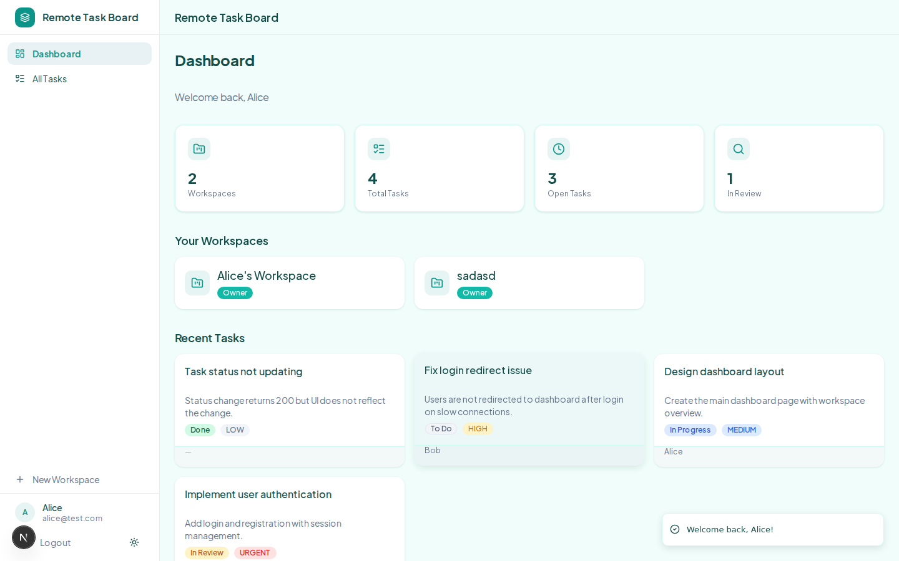
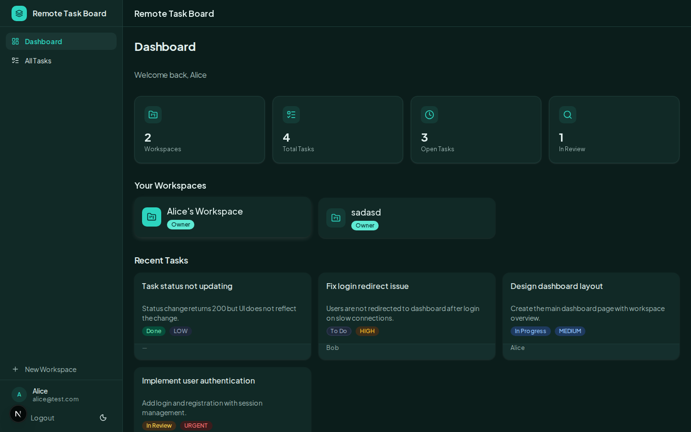
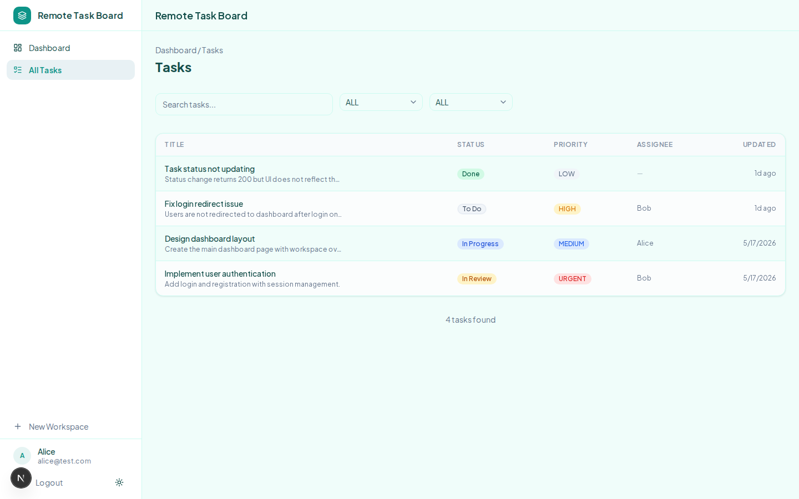
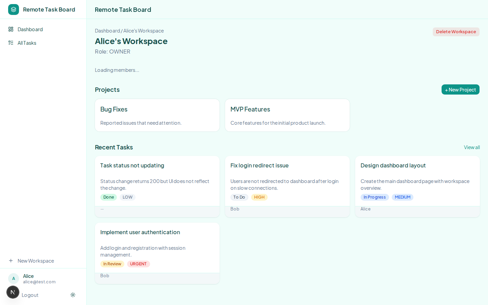
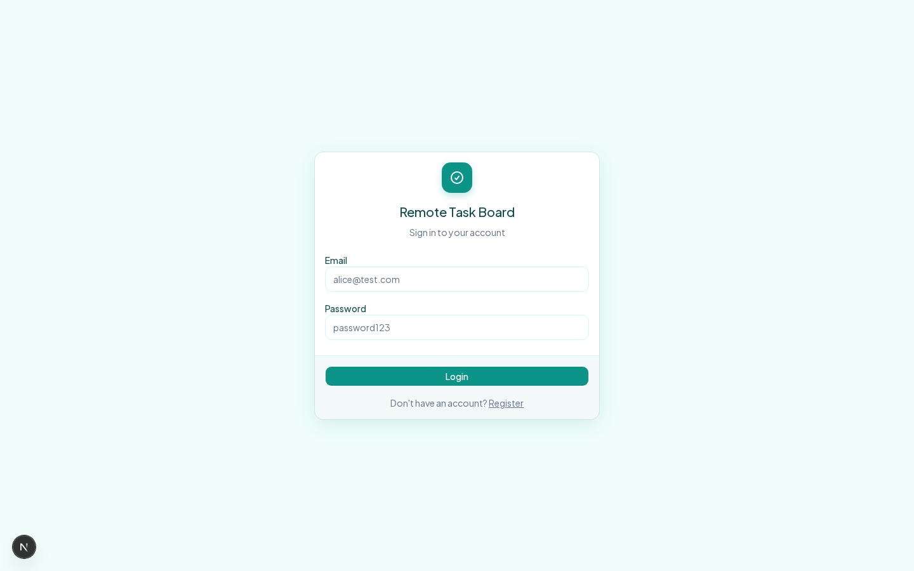
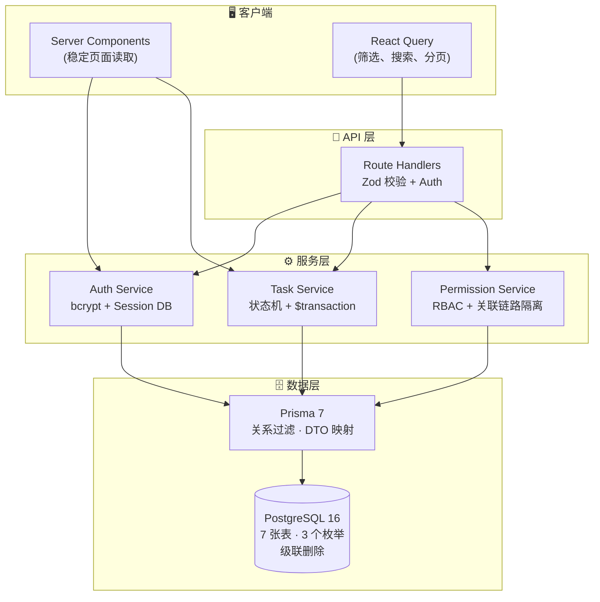

<p align="center">
  <picture>
    <source media="(prefers-color-scheme: dark)" srcset="public/screenshots/dashboard-dark.png">
    
  </picture>
</p>

<h1 align="center">Remote Task Board</h1>

<p align="center">
  <a href="./README.md">English</a> &nbsp;|&nbsp; <b>简体中文</b>
</p>

<p align="center">
  面向远程团队的全栈任务管理平台 — 现代 TypeScript 全栈工程实践示范。
</p>

<p align="center">
  <a href="https://github.com/GarrisonPJ/remote-task-board/actions/workflows/ci.yml"></a>
  <a href="#测试策略"></a>
  <a href="#技术栈"></a>
  <a href="LICENSE"></a>
</p>

---

<p align="center">
  <a href="https://remote-task-board.netlify.app"><strong>🔗 在线体验</strong></a>
  &nbsp;·&nbsp;
  <a href="#界面截图"><strong>📸 界面截图</strong></a>
  &nbsp;·&nbsp;
  <a href="#系统架构"><strong>🏗️ 系统架构</strong></a>
  &nbsp;·&nbsp;
  <a href="#一键启动"><strong>⚡ 一键启动</strong></a>
  &nbsp;·&nbsp;
  <a href="#技术栈"><strong>🧱 技术栈</strong></a>
  &nbsp;·&nbsp;
  <a href="#测试策略"><strong>🧪 测试</strong></a>
</p>

<p align="center">
  <sub>演示账号: <code>alice@test.com</code> / <code>bob@test.com</code> / <code>charlie@test.com</code> / <code>dave@test.com</code> — 密码: <code>password123</code></sub>
</p>

---

## 界面截图

<details open>
<summary><strong>仪表盘</strong> — 工作区与项目概览，支持暗色模式</summary>
<br>
<p align="center">
  
  <br><sub>亮色模式</sub>
  <br><br>
  
  <br><sub>暗色模式</sub>
</p>
</details>

<details>
<summary><strong>任务面板</strong> — 全文搜索、状态/优先级筛选、URL 驱动的分页</summary>
<br>
<p align="center">
  
</p>
</details>

<details>
<summary><strong>工作区</strong> — 成员管理与角色权限控制</summary>
<br>
<p align="center">
  
</p>
</details>

<details>
<summary><strong>登录页</strong> — 基于 bcrypt 的自定义 Session 认证</summary>
<br>
<p align="center">
  
</p>
</details>

---

## 系统架构



### 核心设计决策

| 决策 | 说明 |
|---|---|
| **状态机** | `TODO → IN_PROGRESS → IN_REVIEW → DONE`，支持取消与恢复路径。无效的状态转换在服务端被拒绝，每次状态变更包裹在 Prisma `$transaction` 中确保任务更新与活动日志原子写入。 |
| **数据隔离** | 多租户隔离通过 Prisma 关系过滤实现：`Task → Project → Workspace → WorkspaceMember(where userId = actorId)`。查询本身就是隔离边界，无需中间件拦截。 |
| **RBAC 权限** | 三级角色：OWNER（完全控制）、MEMBER（仅自己的任务）、VIEWER（只读）。权限函数在 `lib/constants.ts` 中统一定义，服务端与客户端共享，确保 UI 守卫一致性。 |
| **混合数据获取** | 稳定页面读取走 Server Components（仪表盘、工作区、项目、任务详情）；交互式任务列表走 React Query + Route Handlers，筛选条件通过 URL 参数驱动。 |
| **自定义认证** | bcryptjs（12 轮哈希）+ httpOnly Cookie + Session 表。无 JWT，无第三方认证服务。登出即删 Session 记录，即时生效。 |

> 完整架构文档：[`CONTEXT.md`](CONTEXT.md) · [ADR 索引](docs/adr/)

---

## 技术栈

| 层级 | 技术选型 | 理由 |
|---|---|---|
| 框架 | **Next.js 16** (App Router) | Server Components 处理稳定页面读取；Route Handlers 处理带认证的写操作 |
| 语言 | **TypeScript 5** (strict) | 全 strict 模式 — 业务逻辑中无 `any`、无 `as` 强制转换 |
| 数据库 | **PostgreSQL 16** | 真正的关系型数据库，引用完整性、级联删除、复合唯一键 |
| ORM | **Prisma 7** | 类型安全查询，`@prisma/adapter-pg` 适配器。关联链路过滤实现数据隔离 |
| 认证 | **自定义 Session** (bcryptjs + httpOnly cookie) | Session 存 PostgreSQL，`SameSite=Lax`，`HttpOnly`，生产环境启用 `Secure` |
| UI | **Tailwind CSS v4** + **shadcn/ui** + **@base-ui/react** | CSS 变量设计令牌。完整暗色模式。尊重 `prefers-reduced-motion` |
| 客户端状态 | **TanStack React Query v5** | 任务列表的 URL 驱动筛选/分页。写操作自动失效缓存 |
| 校验 | **Zod v4** | 每个 Route Handler 均做服务端输入校验。Schema 与 TypeScript 类型推导共享 |
| E2E 测试 | **Playwright** | 26 个 E2E + 45 个单元 = 71 个测试，覆盖 6 个 spec + 5 个单元测试文件 |
| CI | **GitHub Actions** | Postgres service container → migrate → seed → typecheck → build → unit test + coverage → E2E |
| AI（可选） | **OpenAI SDK / DeepSeek** | 自然语言创建任务。未配置 `DEEPSEEK_API_KEY` 时自动隐藏 |

---

## 一键启动

### 环境要求

- **Node.js** 20+ · **pnpm** 9
- **Docker**（用于 PostgreSQL）或已有的 PostgreSQL 16 实例

### 一行命令启动

```bash
# 克隆项目并进入目录
git clone https://github.com/GarrisonPJ/remote-task-board.git && cd remote-task-board

# 启动 PostgreSQL
docker compose up -d

# 安装依赖、初始化数据库、启动开发服务器
pnpm install && cp .env.example .env && pnpm prisma:generate && pnpm prisma:migrate && pnpm db:seed && pnpm dev
```

打开 [http://localhost:3000](http://localhost:3000) 使用 `alice@test.com` / `password123` 登录。

### 分步启动

```bash
pnpm install

# PostgreSQL（Docker）
docker compose up -d

# 或使用自己的 PostgreSQL — 修改 .env 中的 DATABASE_URL 即可
cp .env.example .env

# 生成 Prisma Client、执行迁移、填充演示数据
pnpm prisma:generate
pnpm prisma:migrate
pnpm db:seed

# 启动开发服务器
pnpm dev
```

| 演示账号 | 密码 | 角色 |
|---|---|---|
| `alice@test.com` | `password123` | OWNER — 工作区 1 完全控制 |
| `bob@test.com` | `password123` | OWNER (工作区 2) / MEMBER (工作区 1) |
| `charlie@test.com` | `password123` | MEMBER — 工作区 1 成员 |
| `dave@test.com` | `password123` | VIEWER — 工作区 1 只读访客 |

> 在 `.env` 中设置 `DEEPSEEK_API_KEY` 可启用 AI 自然语言创建任务功能。未配置时该功能自动隐藏。

---

## 测试策略

**71 个测试**覆盖 Playwright (E2E) 和 Vitest (单元测试)，全部基于真实 PostgreSQL 实例运行——零 Mock。

```bash
pnpm test:e2e        # Playwright E2E（26 个测试，6 个 spec）
pnpm test:unit       # Vitest 单元测试（45 个测试）
pnpm test:coverage   # Vitest + 覆盖率报告
```

| Spec 文件 | 测试数 | 覆盖内容 |
|---|---|---|
| `core-flow.spec.ts` | 6 | 注册 → 登录 → 登出 → 创建工作区/项目/任务 → 状态变更 |
| `task-status.spec.ts` | 3 | 所有合法状态转换；非法转换返回 400；取消 → 重新打开 |
| `permission.spec.ts` | 5 | MEMBER 不可删除他人任务；VIEWER 不可创建任务；OWNER 可绕过删除限制 |
| `isolation.spec.ts` | 3 | 用户 A 无法看到用户 B 的数据，即使知道 UUID |
| `api-security.spec.ts` | 6 | 未认证请求返回 401；非成员访问返回 404；输入校验（空标题、无效状态、无效邮箱） |
| `comment-flow.spec.ts` | 3 | 评论增删查；空内容拒绝；未认证 401 |

CI 流水线：`Postgres service container` → `migrate` → `seed` → `typecheck` → `build` → `unit test + coverage` → `Playwright E2E`

---

## 项目结构

```
remote-task-board/
├── app/
│   ├── (app)/              # 需认证页面（带侧边栏布局）
│   │   ├── dashboard/
│   │   ├── workspaces/[id]/
│   │   ├── projects/[id]/
│   │   └── tasks/
│   ├── (auth)/             # 登录、注册（无侧边栏）
│   └── api/                # Route Handlers（认证 + Zod 校验）
├── components/
│   ├── ui/                 # shadcn/ui 基础组件
│   ├── layout/             # AppShell, Sidebar, Header
│   ├── workspace/          # WorkspaceCard, MemberList, CreateDialog
│   ├── project/            # ProjectCard, CreateDialog
│   ├── task/               # TaskList, TaskForm, TaskFilters, TaskStatusControl
│   └── comment/            # CommentList, CommentForm
├── lib/                    # 基础设施：prisma, auth, env, constants, errors, cookie-options
├── services/               # 业务逻辑：auth, workspace, project, task, comment
├── schemas/                # Zod 输入校验 Schema
├── types/                  # 领域类型（DTO）+ API 响应类型
├── prisma/                 # Schema、迁移、种子数据
└── tests/                  # Playwright E2E 测试
```

---

## 功能范围说明

- ActivityLog 目前记录状态变更，非完整审计追踪
- 评论支持创建和列表展示，暂不支持编辑、删除和嵌套回复
- 面向小团队设计（5–50 人），不覆盖企业级组织层级

以上均为明确的范围取舍，非功能缺失。在生产场景中，每一项都可以作为有意义的扩展方向。

---

<p align="center">
  <sub>技术栈：TypeScript · Next.js · PostgreSQL · Prisma · Tailwind CSS · Playwright</sub>
</p>
