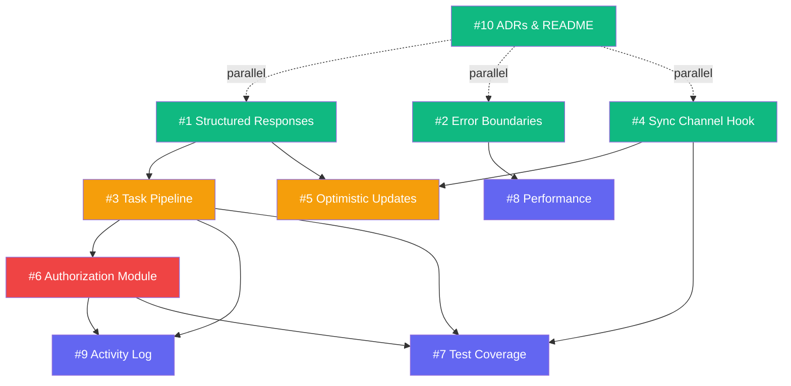

# Issues Breakdown: Remote Task Board Improvements

> Tracer-bullet vertical slices derived from [PRD: Resume-Grade Improvements](file:///C:/Users/Garry/.gemini/antigravity/brain/58d82eef-bb76-4e80-9765-17f93c24539f/prd-resume-improvements.md)

---

## Issue #1: Structured Server Action Responses

- **Type**: AFK
- **Blocked by**: None — can start immediately

### What to build

Standardize all Server Action return types to `{ success: boolean, data?: T, error?: { code: string, message: string } }`. Update `task-service.ts` and `member-service.ts` to catch errors and return structured responses instead of throwing. Update all client-side callers (`create-task-dialog.tsx`, `edit-task-dialog.tsx`, `task-card.tsx`, `member-management.tsx`) to handle the new response shape and show toast notifications on failure.

This is the foundation slice — every subsequent issue depends on structured responses for consistent error handling.

### Acceptance criteria

- [ ] All Server Actions return `{ success, data?, error? }` instead of throwing
- [ ] Client components show toast notifications on error (not `console.error`)
- [ ] Zod validation errors are captured and returned as structured errors
- [ ] Auth failures return `{ success: false, error: { code: 'UNAUTHORIZED' } }`
- [ ] Existing unit tests updated to assert on new response shape
- [ ] No breaking changes to existing E2E tests

---

## Issue #2: Error Boundaries & Loading States

- **Type**: AFK
- **Blocked by**: None — can start immediately (parallel with #1)

### What to build

Add Next.js conventional error handling files at the dashboard route level. Create `app/dashboard/error.tsx` (Error Boundary with retry button), `app/dashboard/loading.tsx` (skeleton UI matching Board layout — 3 columns with card-shaped placeholders), and `app/dashboard/not-found.tsx`. The Error Boundary should log the error details and offer a "Try Again" action.

### Acceptance criteria

- [ ] `error.tsx` renders on Server Component failure, shows error message + retry button
- [ ] `loading.tsx` renders a 3-column skeleton that matches the Board layout
- [ ] Error Boundary catches client-side React crashes without destroying the full page
- [ ] Skeleton uses `animate-pulse` for a polished loading feel
- [ ] Playwright test covers: navigate to dashboard → verify skeleton appears → verify board loads

---

## Issue #3: Deepen Task Mutation Module (Pipeline)

- **Type**: AFK
- **Blocked by**: #1 (structured responses)

### What to build

Refactor `task-service.ts` from four independent Server Actions into a pipeline pattern. Extract a shared `executeMutation` function that handles: authenticate → validate → persist → broadcast → return structured response. Individual mutations (`createTask`, `updateTask`, `deleteTask`) become descriptors passed to the pipeline.

The external interface of `task-service.ts` does NOT change — callers still import `createTask`, `updateTask`, etc. The deepening is internal.

### Acceptance criteria

- [ ] Auth check happens in exactly one place (the pipeline)
- [ ] Pusher broadcast happens in exactly one place (the pipeline)
- [ ] Zod validation is dispatched by the pipeline based on operation type
- [ ] Adding a new mutation requires defining only its data shape and Prisma call
- [ ] All existing unit tests pass without modification (interface unchanged)
- [ ] New unit test: test the pipeline itself with mock auth/prisma/pusher

---

## Issue #4: Sync Event Module — Client-Side `useSyncChannel` Hook

- **Type**: AFK
- **Blocked by**: None — can start immediately

### What to build

Extract a `useSyncChannel` custom hook from the raw `useEffect` in `task-board.tsx`. The hook encapsulates:
- Subscribing to a named Channel
- Binding/unbinding typed event handlers
- Tracking connection state: `connected | connecting | disconnected | error`
- Automatic reconnection with exponential backoff (1s → 2s → 4s → 8s, max 30s)
- Exposing connection state to the UI

Update `task-board.tsx` to use the new hook. Add a connection status indicator in the dashboard header.

### Acceptance criteria

- [ ] `useSyncChannel` hook exported from `lib/hooks/use-sync-channel.ts`
- [ ] Hook accepts channel name and event handlers as typed parameters
- [ ] Connection state (`connected | connecting | disconnected`) exposed via return value
- [ ] Automatic reconnection with exponential backoff implemented
- [ ] Dashboard header shows connection status dot (green/yellow/red)
- [ ] `task-board.tsx` uses the hook instead of raw `useEffect`
- [ ] Unit test: test hook with mock PusherClient — verify bind/unbind lifecycle
- [ ] Unit test: simulate disconnect → verify reconnection attempt

---

## Issue #5: Optimistic Updates for Task Status Transitions

- **Type**: AFK
- **Blocked by**: #1 (structured responses), #4 (sync channel)

### What to build

Implement optimistic UI for drag-and-drop Status transitions using React 19's `useOptimistic`. When a Member drags a Task to a new column:
1. Immediately move the Task in the UI (optimistic)
2. Send the Server Action in the background
3. On success: no-op (already in correct state)
4. On failure: roll back the Task to its previous column + show error toast

### Acceptance criteria

- [ ] Drag-and-drop Status changes appear instantly in the UI
- [ ] Server Action failure rolls back the Task to its original column
- [ ] Error toast shows on rollback
- [ ] Visual transition animation during optimistic move (subtle fade/slide)
- [ ] Optimistic state reconciles correctly with incoming Sync Events
- [ ] Playwright test: drag task → verify instant move → verify persistence after reload

---

## Issue #6: Authorization Module — Declarative Policy

- **Type**: HITL (needs design confirmation for permission matrix)
- **Blocked by**: #3 (pipeline — policy integrates into the pipeline)

### What to build

Extract authorization from inline `role !== 'ADMIN'` checks into a declarative policy module. The module exports a single `authorize(action, context)` function that evaluates a policy map.

Schema change: add `creatorId` field to Task model. Migration should backfill existing Tasks with `null` creator.

Policy decisions:
- `task:create` → any Member
- `task:update` → any Member (Status transitions should be open)
- `task:delete` → Admin OR Task creator
- `member:invite` → Admin only
- `member:remove` → Admin only

### Acceptance criteria

- [ ] `lib/authorization.ts` exports `authorize(action, context)` function
- [ ] Policy map defined as a typed constant — adding new actions requires one new entry
- [ ] `creatorId` field added to Task schema via Prisma migration
- [ ] `task-service.ts` pipeline uses `authorize()` instead of inline checks
- [ ] `member-service.ts` uses `authorize()` instead of inline checks
- [ ] UI hides delete button for non-Admin non-creator Members
- [ ] Unit tests: verify each policy entry (pure function, no mocks needed)
- [ ] E2E test: Member cannot delete another Member's Task

---

## Issue #7: Test Coverage & CI Badge

- **Type**: AFK
- **Blocked by**: #3, #4, #6 (need the new modules to exist for meaningful coverage)

### What to build

Configure Vitest to generate coverage reports (`@vitest/coverage-v8`). Add coverage badge to README. Update GitHub Actions CI workflow to run coverage and fail if below threshold (80% for service modules). Add component-level tests for critical UI interactions.

### Acceptance criteria

- [ ] `vitest.config.ts` configured with coverage provider
- [ ] `pnpm test:coverage` script added to package.json
- [ ] Coverage report generated in CI and uploaded as artifact
- [ ] README displays coverage badge
- [ ] Coverage threshold: 80% lines for `services/`, `lib/authorization.ts`, `lib/hooks/`
- [ ] Component test: `task-filter.tsx` filtering behavior
- [ ] Component test: `login-form.tsx` validation and error states
- [ ] CI fails if coverage drops below threshold

---

## Issue #8: Performance — Suspense Streaming & Pagination

- **Type**: AFK
- **Blocked by**: #2 (loading states)

### What to build

Wrap the dashboard data fetching in `<Suspense>` boundaries to enable streaming SSR. Implement cursor-based pagination on `getTasks()` to handle large Task counts. Add `next/web-vitals` reporting. Add virtual scrolling to task columns when Task count > 50 per column.

### Acceptance criteria

- [ ] Dashboard page uses `<Suspense>` with the skeleton from Issue #2
- [ ] `getTasks` supports cursor-based pagination (default page size: 50)
- [ ] "Load more" button appears when more Tasks are available
- [ ] Web Vitals (LCP, FID, CLS) reported via `reportWebVitals`
- [ ] FCP < 1.5s on simulated 3G (measure and document in README)
- [ ] Virtual scrolling activates for columns with > 50 Tasks

---

## Issue #9: Activity Log & Audit Trail

- **Type**: AFK
- **Blocked by**: #3 (pipeline — logs are emitted from the pipeline), #6 (authorization — need creatorId)

### What to build

Add an `ActivityLog` model to the Prisma schema that records Task mutations. The Task mutation pipeline emits log entries automatically. Add an admin-visible activity feed showing recent actions.

Schema:
```
ActivityLog: id, action (CREATED/UPDATED/DELETED), taskId, taskTitle, actorId, actorName, details (JSON), createdAt
```

### Acceptance criteria

- [ ] `ActivityLog` model added to Prisma schema
- [ ] Task mutation pipeline automatically creates log entries
- [ ] Admin dashboard section shows recent activity (last 50 entries)
- [ ] Activity entries show: who, what action, which Task, when
- [ ] Non-admin Members cannot see the activity log
- [ ] Playwright test: create task → verify activity log entry appears for admin

---

## Issue #10: ADRs & README Polish

- **Type**: AFK
- **Blocked by**: None — can start immediately (parallel with everything)

### What to build

Document existing architectural decisions as ADRs. Update README with improved architecture diagram, performance data, badges, and "Technical Decisions" section.

ADRs to write:
1. **Server Actions over REST API** — chosen for type safety, reduced boilerplate, and RSC integration
2. **Soketi over Pusher Cloud** — chosen for data privacy, cost control, and zero external dependencies
3. **Last-write-wins over CRDT** — chosen because conflict frequency is low and CRDT complexity isn't justified

README additions:
- Updated architecture diagram (Mermaid) showing the deepened modules
- CI badge, coverage badge, TypeScript badge
- "Technical Decisions" section linking to ADRs
- Running screenshot / GIF

### Acceptance criteria

- [ ] `docs/adr/0001-server-actions-over-rest.md` written
- [ ] `docs/adr/0002-soketi-over-pusher-cloud.md` written
- [ ] `docs/adr/0003-last-write-wins-over-crdt.md` written
- [ ] README includes Mermaid architecture diagram
- [ ] README includes CI status badge
- [ ] README includes "Technical Decisions" section with ADR links
- [ ] Each ADR follows the concise format: context + decision + why

---

## Dependency Graph



**Legend**: 🟢 Green = can start immediately | 🟡 Amber = blocked by 1 issue | 🔴 Red = HITL | 🟣 Purple = blocked by 2+ issues

---

## Recommended Execution Order

### Wave 1 (Parallel — Day 1-2)
- **#1** Structured Responses
- **#2** Error Boundaries & Loading
- **#4** Sync Channel Hook
- **#10** ADRs & README (ongoing)

### Wave 2 (Day 2-3)
- **#3** Task Pipeline (after #1)
- **#5** Optimistic Updates (after #1, #4)

### Wave 3 (Day 3-4)
- **#6** Authorization Module (after #3) — HITL checkpoint here
- **#8** Performance (after #2)

### Wave 4 (Day 4-5)
- **#7** Test Coverage (after #3, #4, #6)
- **#9** Activity Log (after #3, #6)
